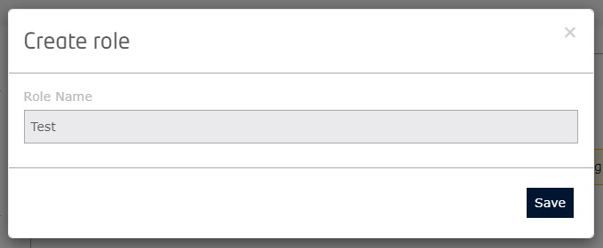

Keyrock
=======

Access control
--------------

To manage access control, and define who has the right to read, write and delete data in a workspace, ouranos-ws also uses Keyrock.

To give a user access to a workspace, go to the ouranos-ws application in Keyrock. At the top of the page, click on "manage roles".

Once in the role manager, click on the "+" button next to "Roles" to create a new one.

Simply enter the role name and click "Save".

Click on the "+" button next to "Permissions" to create a new permission.

Enter a name and a description. Define the http action (GET for read, POST for write and DELETE for delete). Finally, define the resource that should be the identifier of the workspace entity.

.. image:: ../images/keyrock/5-create-permission.png

Repeat the operation as many times as necessary to define the workspaces and associated rights of the role.

Once the role and the permissions have been created, click on the role and then on each permission to be associated with it. Click on the "Save" button.

Back to the Keyrock ouranos-ws application, in the "Authorized users" section, click on the "Authorize" button.

Search for the user in "All users" then click on the "+" button next to his name.

Assign it the previously created role, then click on the "Save" button.

